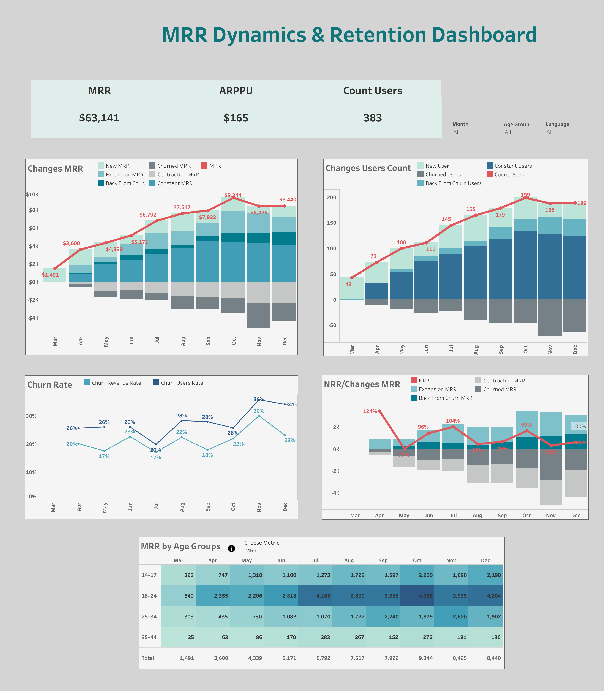

# MRR Dynamics & Retention Dashboard

## Dashboard Description

This dashboard is focused on analyzing monthly revenue dynamics, paying users, retention, and the quality of user segments.

The main goal of the dashboard is to understand how MRR changes over time, which factors drive revenue growth or decline, how users behave after making a payment, and which age groups contribute the most to business performance.

The dashboard combines several levels of analysis:

- Overview of key KPIs: **MRR**, **ARPPU**, and **Count Users**

- Decomposition of MRR changes: **New MRR**, **Expansion MRR**, **Back From Churn MRR**, **Churned MRR**, **Contraction MRR**, and **Constant MRR**

- Analysis of changes in the paying user base: **New Users**, **Churned Users**, **Back From Churn Users**, and **Constant Users**

- Analysis of churn rate by users and revenue

- Evaluation of **NRR** and the impact of expansion, contraction, churn, and reactivation on revenue

- Analysis of key metrics by age group

The bottom section of the dashboard includes a **Choose Metric** switcher, which allows users to change the displayed metric by age group: **MRR**, **LT**, **LTV**, and **ARPPU**.

This functionality helps not only to identify which age group generates the most revenue, but also to evaluate audience quality: how long users stay in the product, how much revenue they generate over their lifetime, and what average revenue each paying user brings.

## Key Metrics

**MRR** — Monthly recurring revenue. Shows the total amount of recurring revenue generated during the month.

**New MRR** — Revenue from new paying users.

**Expansion MRR** — Additional revenue from existing users who started paying more.

**Contraction MRR** — Revenue lost from existing users who started paying less.

**Churned MRR** — Revenue lost due to users who stopped paying.

**Back From Churn MRR** — Revenue from users who returned after a period without payments.

**Constant MRR** — Stable revenue from users who continued paying without changes.

**Count Users** — Number of paying users.

**New Users** — New paying users.

**Churned Users** — Users who stopped paying.

**Back From Churn Users** — Users who returned after churn.

**Constant Users** — Users who continue paying month after month.

**ARPPU** — Average revenue per paying user.

**LT** — Lifetime, the average duration of a user’s lifetime in the product.

**LTV** — Lifetime value, the total value generated by a user over their lifetime.

**Churn Rate** — The share of users or revenue lost during a given period.

**NRR** — Net Revenue Retention. Shows how well the business retains and expands revenue from existing users, taking into account expansion, contraction, and churn.

## Business Questions

The dashboard helps answer the following business questions:

1. How does MRR change by month, and is revenue growing steadily?

2. What drives MRR changes: new users, expansion, return from churn, or the stable user base?

3. How strongly does churn affect revenue loss?

4. Is the number of paying users growing together with revenue?

5. Are there months where MRR growth is driven not by user growth, but by higher ARPPU?

6. Which age group generates the highest revenue?

7. Which age group has the highest ARPPU?

8. Which age groups have higher LT and LTV?

9. Which segments should be retained, and which should be acquired more actively?

10. How effectively does the business retain existing revenue through NRR?

## Insights and Recommendations

### Overall Revenue Dynamics

From March to December, MRR increased from **$1,491 to $8,440**, which indicates positive revenue dynamics.

The highest MRR was recorded in **October — $9,344**. After that, revenue slightly decreased in November and December, but remained at a relatively high level.

The number of paying users also increased: from **43 users in March to 189 users in December**. The peak was in **October, with 199 users**.

This shows that MRR growth was generally driven not only by higher average revenue, but also by the expansion of the paying user base.

### Age Group Analysis

The **18–24** age group makes the strongest contribution to MRR. In most months, this group generates the highest revenue. For example, in October, MRR for this group reached **$4,988**, which is the highest value among all age segments.

This group can be considered the key revenue segment.

The **14–17** age group shows noticeable MRR growth: from **$323 in March to $2,198 in December**. At the same time, this group has high ARPPU, especially in May — **$63**, and high LTV in some months, for example **$397 in October**.

This may indicate strong monetization potential, but the segment should be analyzed carefully, as younger users’ behavior may be less stable.

The **25–34** age group generates less MRR than 18–24, but looks relatively stable. Its average ARPPU stays approximately within the **$30–50** range, while LTV remains moderate.

This segment may be useful as a stable audience, but to grow revenue, it is important to look for ways to increase engagement and payment frequency.

The **35–44** age group has the lowest MRR contribution and the smallest number of users. Despite some months with solid ARPPU, for example **$42 in June**, the overall revenue volume remains low.

This suggests that the main issue may not only be purchasing power, but also a small audience size and weaker retention.

### LT and LTV Insights

LT shows that user lifetime is unstable across most age groups.

The highest LT values appear in the **14–17** and **18–24** groups, but in some months LT drops to **3–4 months**. This may indicate the need to strengthen retention activities, especially during the first months of product usage.

LTV shows that high MRR does not always mean the highest long-term potential.

For example, the **18–24** group generates the highest MRR, while the **14–17** group shows higher LTV in some months. Therefore, business decisions should not be based only on current revenue, but on the combination of:

**MRR + LT + LTV + ARPPU**

## Recommendations

The main focus should remain on the **18–24** age group, as it generates the largest share of MRR and forms the core paying user base.

For this segment, it is worth developing:

- retention mechanics;

- personalized offers;

- repeat payment scenarios;

- reactivation campaigns for users at risk of churn.

The **14–17** group should be considered a promising growth segment. It shows strong ARPPU and LTV values, so it would be useful to test:

- separate product mechanics;

- improved onboarding flows;

- special offers;

- engagement campaigns to increase repeat payments.

For the **25–34** group, it is worth checking which factors limit MRR growth:

- smaller user base;

- lower engagement;

- weaker repeat payments;

- lower conversion into paid usage.

This segment can be stable, but it requires additional growth hypotheses.

The **35–44** group should not be the main scaling focus without deeper analysis. First, it is important to understand why the segment is small:

- weak acquisition;

- low conversion to payment;

- insufficient product value for this audience;

- weaker retention compared to younger segments.

It is also important to analyze months with declining NRR and increasing churn rate separately.

When NRR falls below **100%**, it means that revenue from existing users is shrinking, and the business has to compensate for these losses with new users.

In the long term, it is better to strengthen retention and expansion so that growth becomes more sustainable.

## Tools
SQL, Tableau

## Links
- [Tableau Dashboard](https://public.tableau.com/views/GamesMRRAnalysis/MRRDynamicsRetentionDashboard?:language=en-US&:sid=&:redirect=auth&:display_count=n&:origin=viz_share_link)
- [SQL Code](./sql_script)

